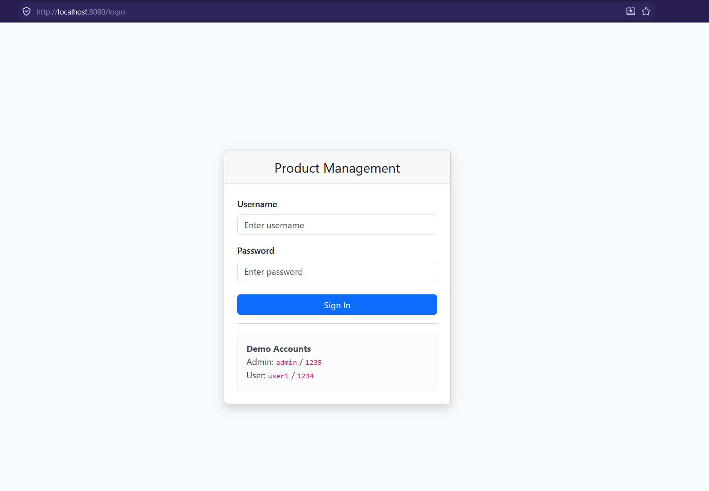
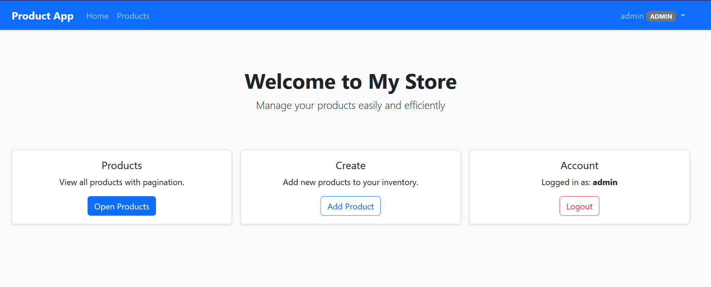
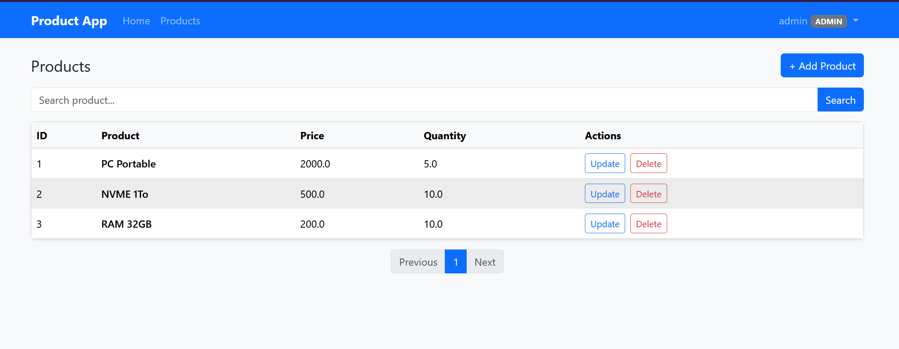
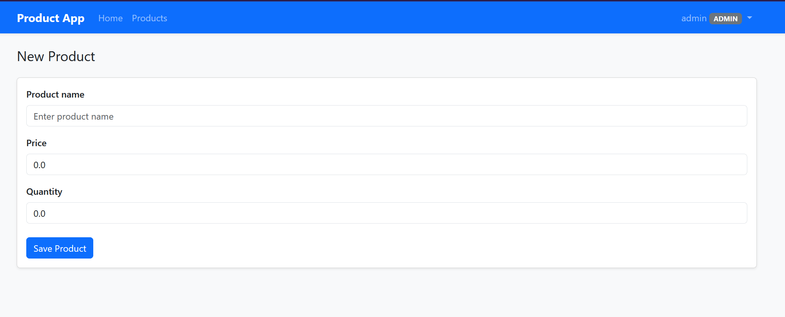
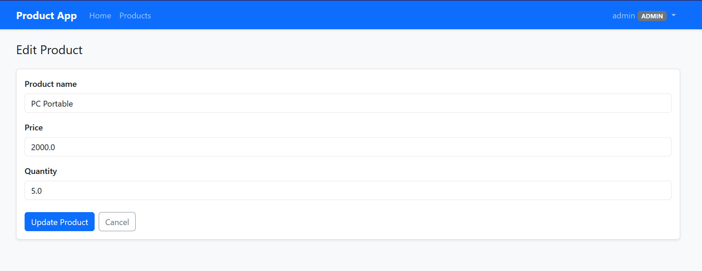
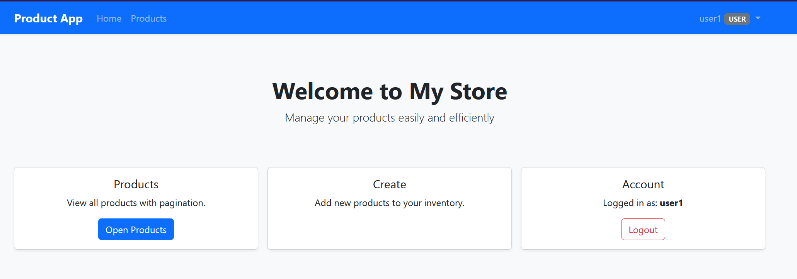
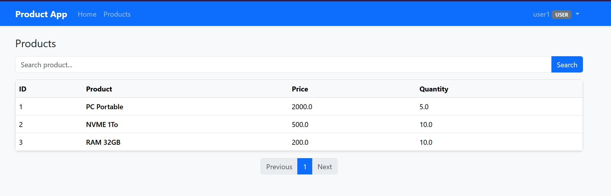
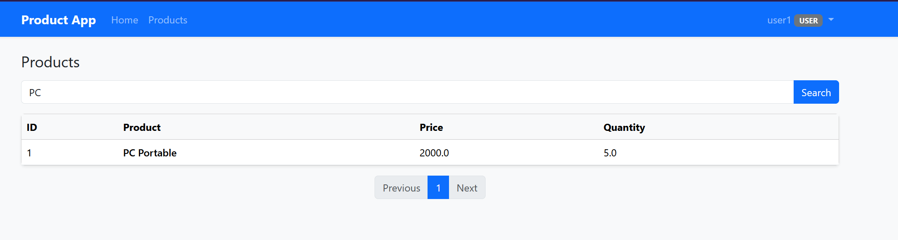

# TP3 — Application Web Spring Boot
## Description d'application
Une application web pour gérer des produits. On peut voir la liste des produits, en ajouter, les modifier et les supprimer — le tout avec une interface graphique dans le navigateur, une connexion sécurisée, et une base de données.
## Aperçu de l'application
### Interface de login

### Views ADMIN
----------------------------------------------------------
#### Home page

#### Product View

#### Add product View

#### Product View

### Views USER
--------------------------------------------------------
#### Home page

#### Product View

#### Product search

## Comptes
|Users | Password|Permissions|
|------|---------|------------|
|admin| 1234| View, Search, Add, Delete, Update|
|user1| 1234| View, Search|
## Fonctionalite de l'application
**1. Voir la liste des produits**
La page principale affiche tous les produits dans un tableau avec leur nom, prix et quantité.

**2. Rechercher un produit**
Une barre de recherche permet de filtrer les produits par nom en temps réel.

**3. Pagination**
Les produits sont affichés par page (5 par page). Des boutons permettent de naviguer entre les pages.

**4. Ajouter un produit (admin seulement)**
Un formulaire avec validation :

* Le nom est obligatoire (entre 3 et 50 caractères)
* Le prix doit être positif
* La quantité doit être positive Si on oublie un champ ou met une valeur incorrecte, un message d'erreur s'affiche directement sous le champ.

**5. Modifier un produit (admin seulement)**
Le même formulaire que l'ajout, mais pré-rempli avec les données existantes.

**6. Supprimer un produit (admin seulement)**
Un bouton rouge avec une confirmation avant suppression.

**7. Se déconnecter**
Un bouton dans la barre de navigation en haut à droite.
## Architecture

Cette application suit le model MVC (model, view, controler)
* ProductControler      => Handle HTTP requests
* ProductRepository     => Write and Read from the Database
* Thymleaf              => Interface

## Database Change
Si vous voullez utiliser une base de donnees MySQL enleve les commentaire de cette parte et commente les elements associe a h2

    spring.datasource.url=jdbc:mysql://localhost:3306/tp3db?createDatabaseIfNotExist=true
    spring.datasource.username=root
    spring.datasource.password=
    spring.jpa.database-platform=org.hibernate.dialect.MySQLDialect
    spring.jpa.hibernate.ddl-auto=update