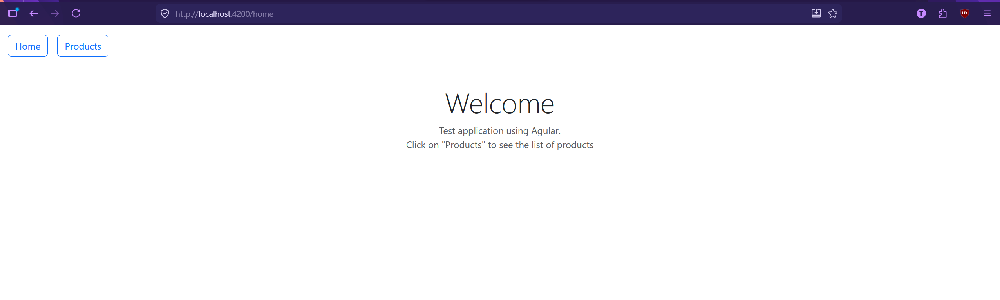
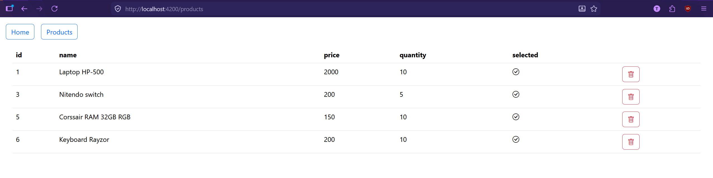
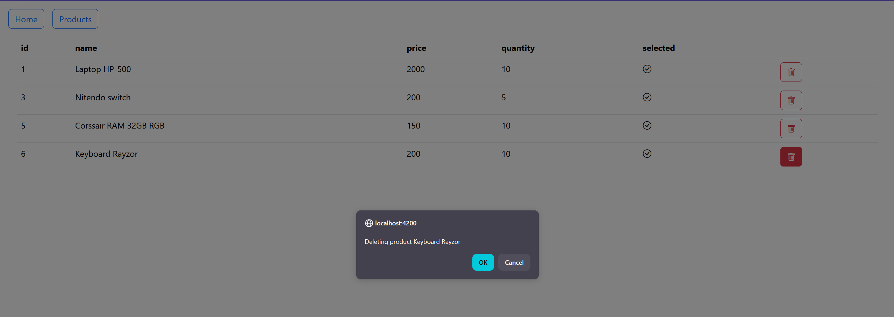
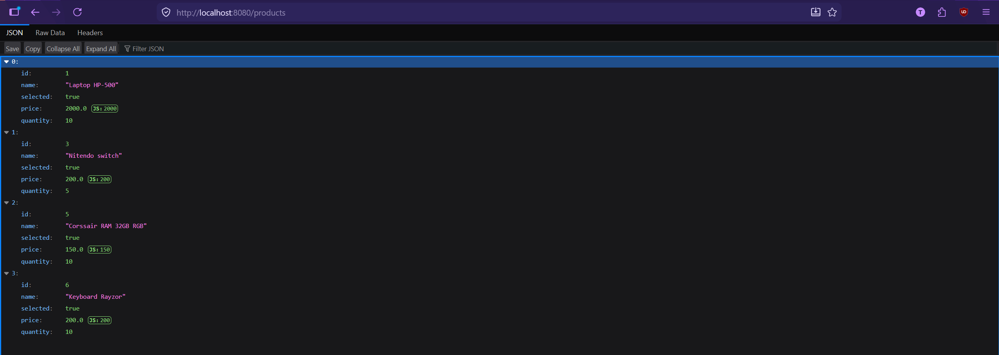

# TP Angular + Spring Boot
Simple application using angular (bootstrap) for the front end, spring boot for the back end and H2 for the database.
## Functions
* Home: Display a simple welcome message
* Products: Display a list of products
* Button delete: To delete a product from the database
## Screenshots
### Home page

### Products list

### Delete product

### Display all the products through the API

## Information on the API
|Method|URL|Description|
|------|---|-----------|
|GET|http://localhost:8080/products|Action to fetch all products|
|GET|http://localhost:8080/products/id|Action to fetch a product using its id|
|DELETE|http://localhost:8080/delete/id|Delete a product based on its id|

