# Bank application (Work in progress)

A full-stack banking management application built with Spring Boot, Angular, Spring Security, and JWT. The application enables administrators to manage customers, bank accounts, and banking operations through a secure REST API and a modern web interface.

## Features
* Customer Management (CRUD)
* Bank Account Management
* Current and Savings Accounts
* Debit and Credit Operations
* Money Transfers
* Search Customers and Accounts
* Secure Authentication with JWT (coming soon)
* RESTful API
* Swagger/OpenAPI Documentation
* AI chatbot (coming soon)
* Dashboard with Charts and Statistics (coming soon)

## Tech stack
### Backend
* Java 17
* Spring Boot 4.0.7
* Spring Web MVC
* Spring Data JPA
* Hibernate
* H2 Database (development)
* MySQL (production)
* Lombok
* SpringDoc OpenAPI (Swagger UI)
* Maven
### Frontend
* Angular 
* Bootstrap 5

## Project roadmap
* ✅ Springboot backend
* ✅ REST API
* ✅ Spring security and Json Web Token
* ✅ Angular frontend
* ⏳ Chatbot AI
* ⏳ Other functions

## Screenshots

### Login interface
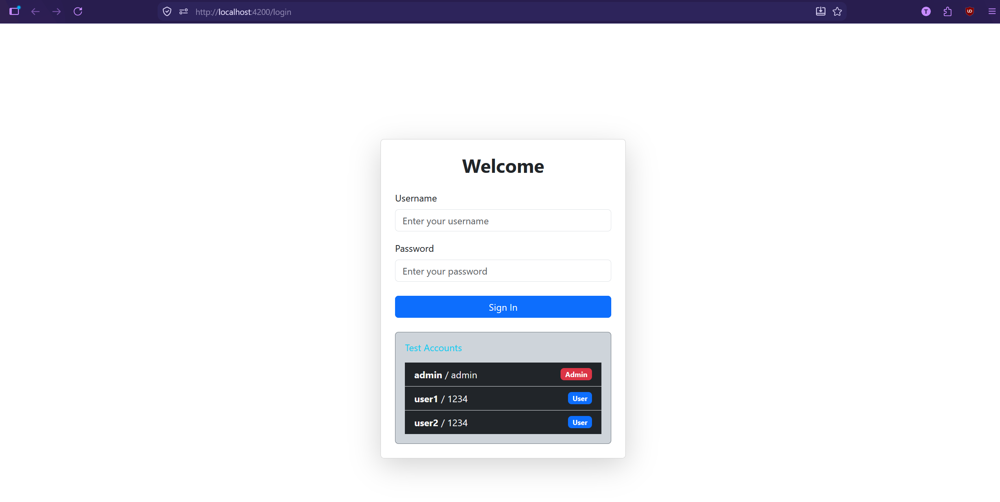

### Admin interface
#### Navbar
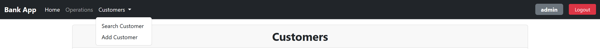
#### Customer list
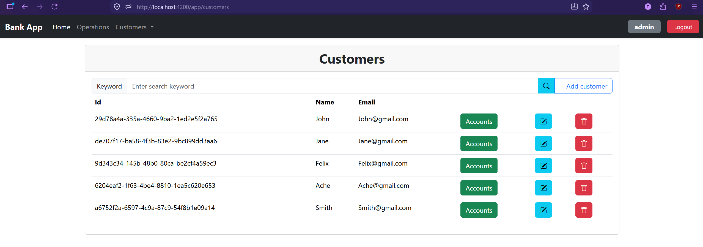
#### Accounts list
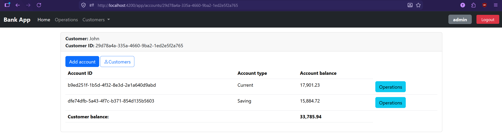
#### Operations list
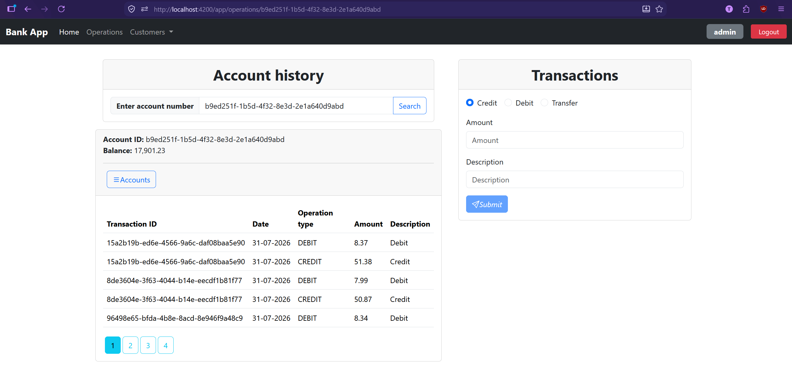
#### Operations list empty
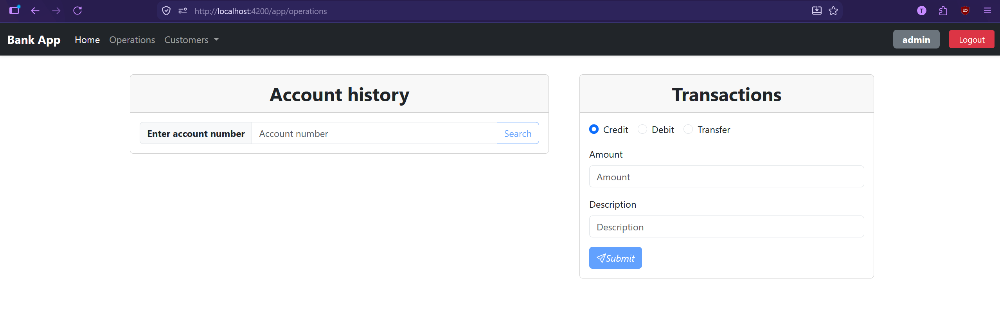
#### Add customer
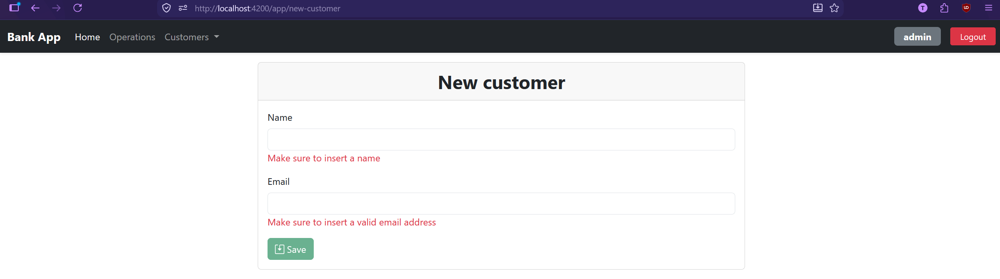
#### Add accounts
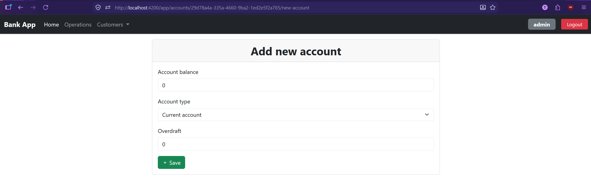
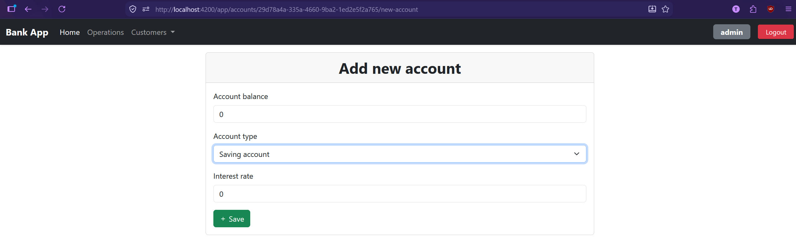
#### Account operations
|Credit|Debit|Transfer|
|------|-----|--------|
|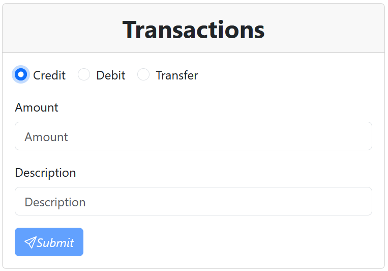 | 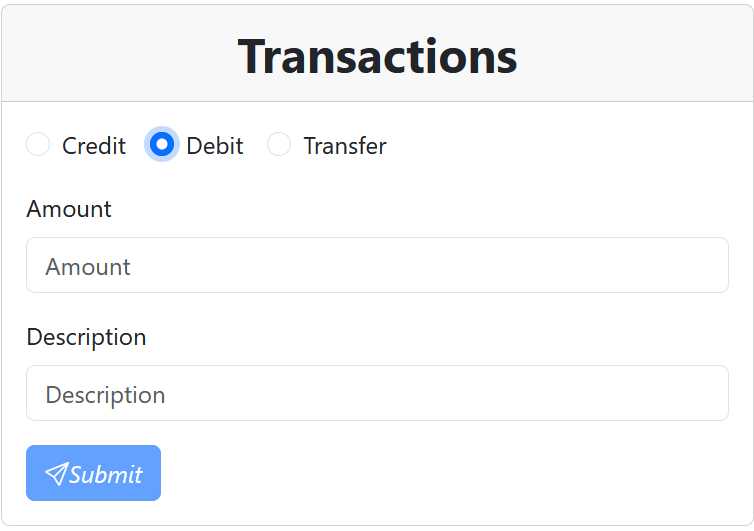 | 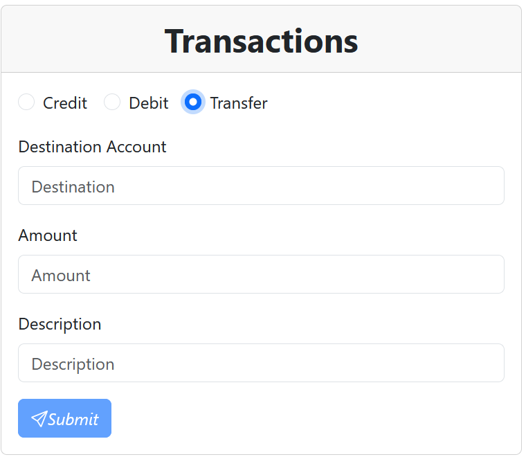|

### User interface
#### Navbar
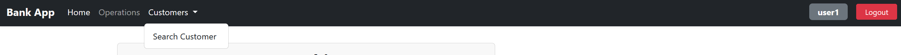
#### Customers list
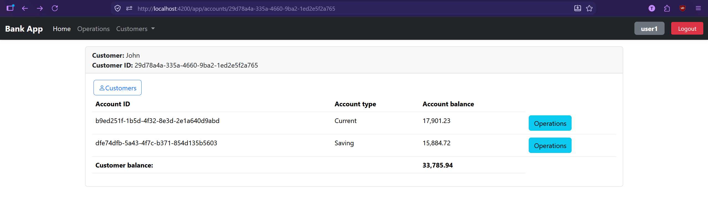
#### Accounts list

#### Operations list
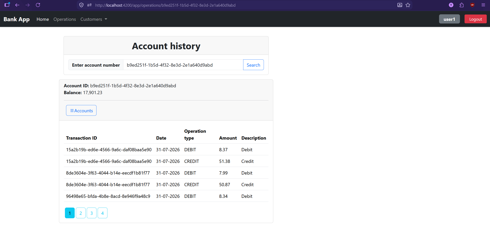
#### Not authorized
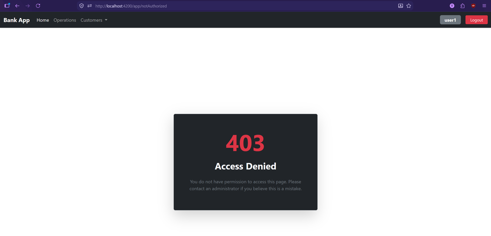

## License
This project was developed for educational purposes and demonstrates the implementation of a secure banking management system using Spring Boot and Angular.