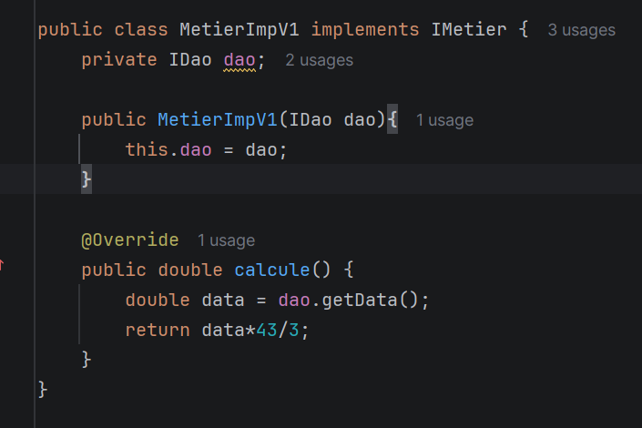
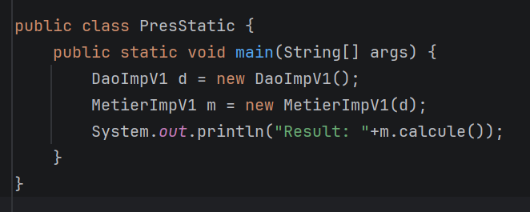
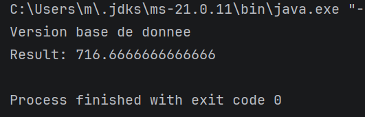

# Activité Pratique N°1 - Injection des dépendances
## Partie 1
###  Implémentation de l'interface Metier utilisant le couplage faible

### Présentation par instanciation static
Code:

Results:

### Présentation par instanciation dynamique

### Présentation par Spring
#### Version XML

#### Version Annotations
