# Activité Pratique N°2 - ORM JPA Hibernate Spring Data

## Initialization des produits
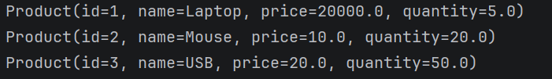

## Interface H2
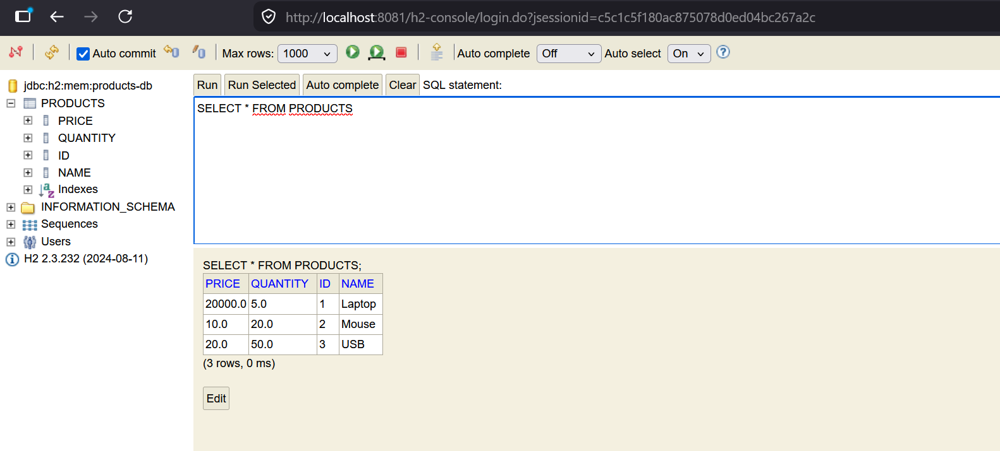

## Test REST API avec SWAGGER UI
### Acces SWAGGER UI
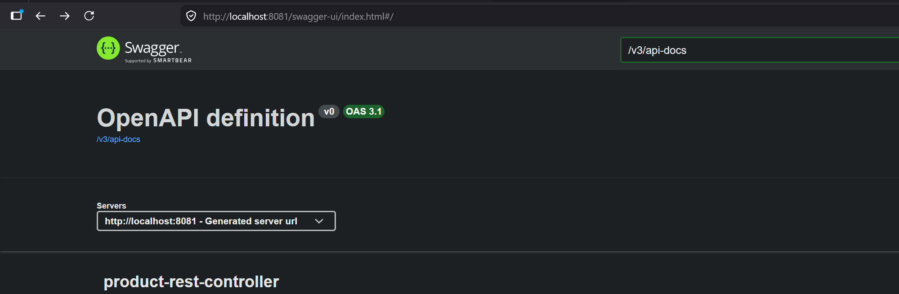
### Endpoints disponible
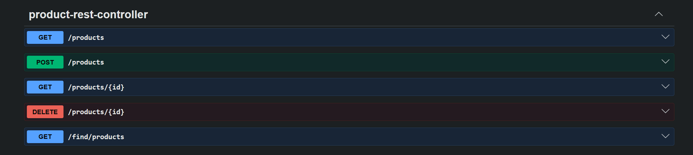
### Affichage des produits
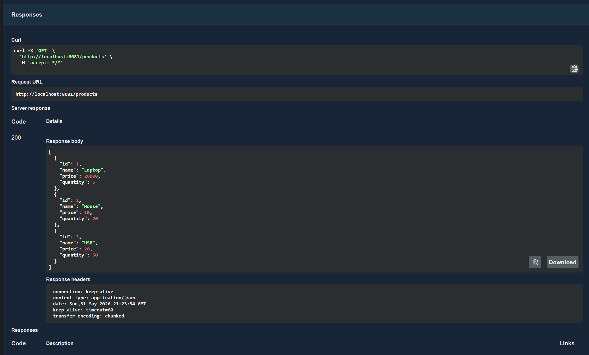
### Ajouter un produit (printer)
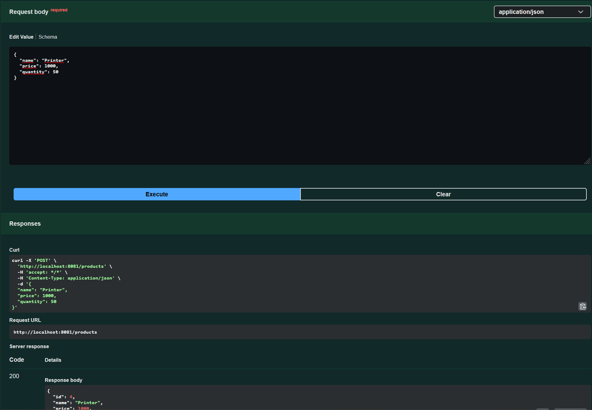
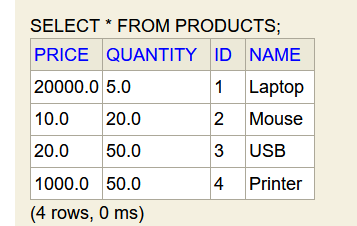
### Afficher produit par ID (4)
Cas avec success:
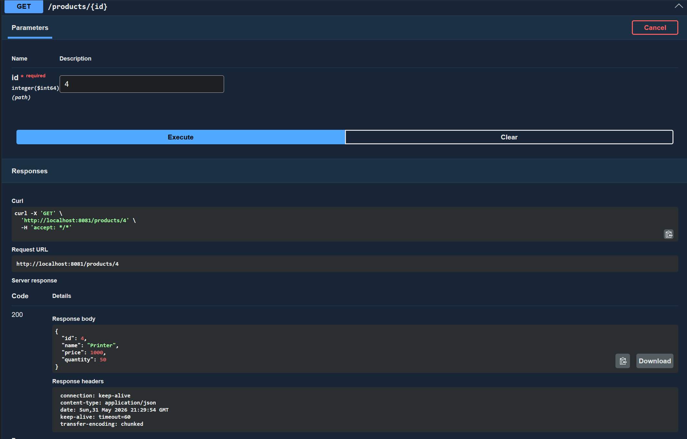

Cas avec erreur:
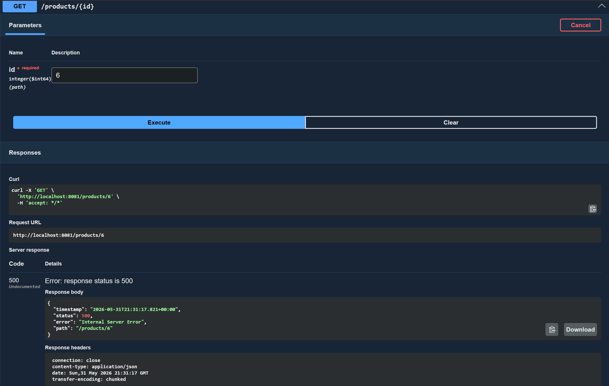
### Afficher produit par keyword
Cas avec success:
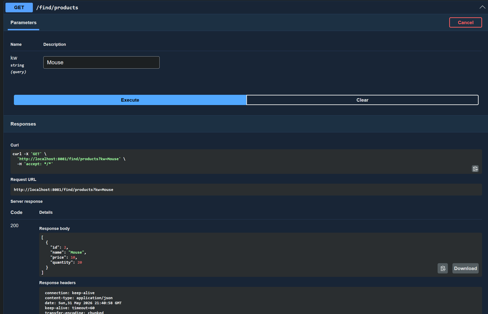
Cas avec aucun produit:
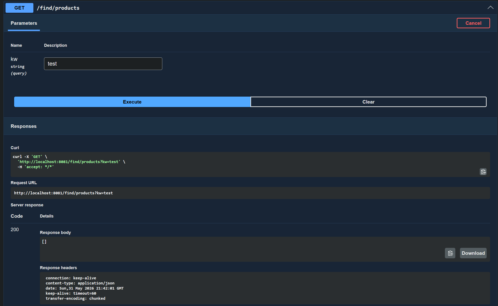
### Suprimer produit par ID (4)
Cas avec success:
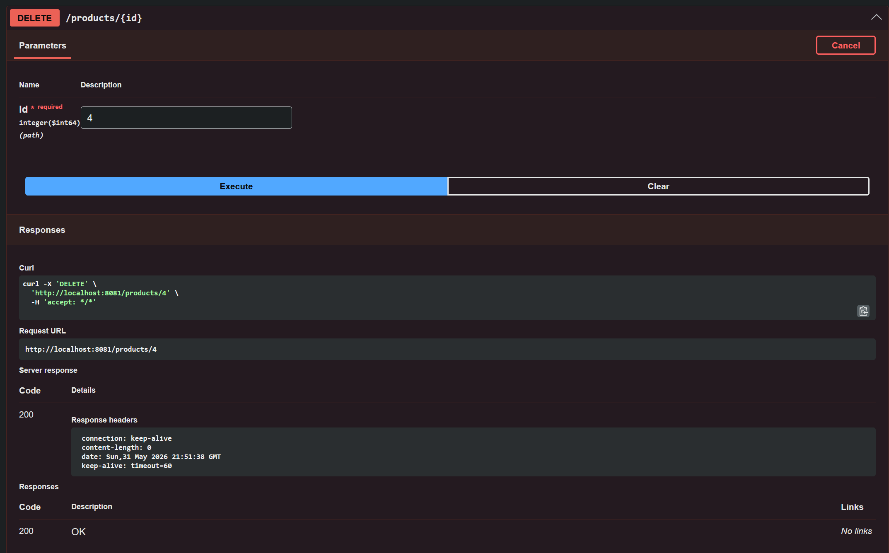
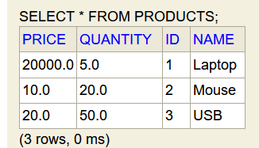

